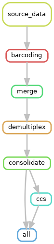

# Preprocessor

**Initial data processing for PacBio amplicon data.**  

The preprocessor module performs the following operations:  
- Combine raw data from multiple SMRT cells
- Transparently handle data from both RS2 and Sequel platforms
- Barcoding
- Demultiplexing
- CCS

## Requirements
- [Conda/Miniconda](https://conda.io/miniconda.html)  

## Installation
- Clone the repository
  - `git clone https://git.lumc.nl/PharmacogenomicsPipe/preprocessor.git`

- Change to the preprocessor directory
  - `cd preprocessor`

- Create a conda environment for running the pipeline
  - `conda env create -n preprocessor -f environment.yaml`

- In order to use the pipeline on the cluster, update your .profile to use the drmaa library:
  - `echo "export DRMAA_LIBRARY_PATH=libdrmaa.so.1.0" >> ~/.profile`
  - `source ~/.profile`

## Configuration
Pipeline configuration settings can be altered by editing [config.yaml](config.yaml).  

## Execution
- Activate the conda environment
  - `source activate preprocessor`
- For parallel execution on the cluster
  - `pipe-runner`
- To specify that the pipeline should write output to a location other than the default:
  - `pipe-runner --directory path/to/output/directory`
          
